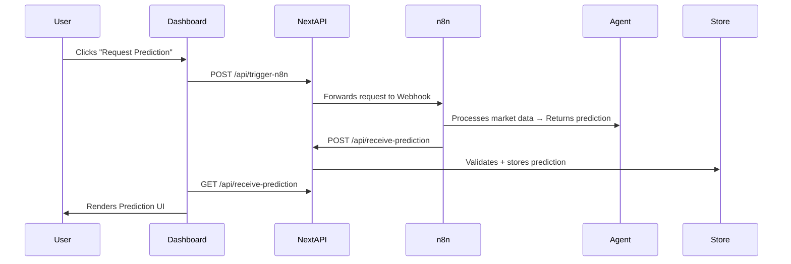

# AI Crypto Market Prediction Dashboard

A real-time, AI-powered dashboard that visualizes cryptocurrency market predictions. It integrates **n8n workflows**, **LLM-based agents**, and **Next.js frontend** to provide sentiment analysis, trading recommendations, and market insights with automated data flow.

---

## 📌 Features

- ✅ Real-time AI market predictions using GPT-based Agentic nodes via n8n
- ✅ Fully automated pipeline with webhooks, Airtable (optional), and AI output parsing
- ✅ Prediction confidence scores and visual indicators
- ✅ Interactive dashboard with dark mode
- ✅ N8N → AI Prediction → POST to `/api/receive-prediction` (Next.js)
- ✅ Secure CORS-friendly proxy to trigger workflows via frontend

---

## 🧠 Tech Stack


| Layer       | Stack                                 |
| ----------- | ------------------------------------- |
| Frontend    | React (Next.js 14, App Router)        |
| Styling     | Tailwind CSS + Lucide Icons           |
| Backend API | Next.js API Routes                    |
| AI Agent    | n8n AI Agentic Node (GPT-4 or Claude) |
| Automation  | n8n Workflows + Webhooks              |
| Data Store  | In-memory (Demo) / Airtable optional  |

---

## 🚀 How It Works



---

## 📦 Folder Structure

```
crypto-prediction-dashboard/
├── pages/
│   └── api/
│       ├── trigger-n8n.js          # Secure proxy to trigger n8n webhook
│       └── receive-prediction.js   # Accepts prediction POST from n8n
├── app/
│   └── page.js                     # Main dashboard UI
├── public/
├── styles/
├── components/
├── README.md
└── ...
```

---

## 🛠️ Setup Instructions

### 1. Clone & Install

```bash
git clone https://github.com/Waize333/Crypto-Update-Agent
cd crypto-prediction-dashboard
npm install
```

### 2. Configure Environment

Create `.env.local` and configure if needed (e.g., for Airtable, external APIs).

### 3. Run Dev Server

```bash
npm run dev
```

Dashboard: [http://localhost:3000](http://localhost:3000)

---

## 🔁 Trigger Prediction Flow

### From Frontend

- Click **“Request Prediction”**
- Sends `POST` to `/api/trigger-n8n`
- Triggers n8n webhook → AI agent makes a prediction
- n8n sends prediction to `/api/receive-prediction`
- Frontend fetches and displays new prediction

---

## 📥 Example AI Prediction Payload

```json
{
  "prediction_id": "pred_20250713123038133_noijv",
  "timestamp": "2025-07-13T12:30:38.133Z",
  "sentiment": "bullish",
  "confidence": 74,
  "reasoning": "Based on BTC price trend and Fear-Greed Index.",
  "recommendation": "Trade"
}
```

---

## ✨ UI Highlights

- Clean, responsive layout
- Icons for sentiment (Bullish/Bearish/Neutral)
- Color-coded recommendation tags
- Confidence bar with animated width
- JSON debug toggle for developers
- Dark mode support with persistence

---

## 🔐 Security & Considerations

- CORS-safe: Frontend calls own backend instead of direct n8n
- Optional: Add basic auth/token to `/api/trigger-n8n`
- Use a database (e.g., Airtable, MongoDB) for production storage
- Deploy frontend on **Vercel**, backend webhook on **n8n cloud**

---

## 📡 Integrations

- **n8n Cloud**: Workflow automation
- **OpenAI / Claude**: AI agentic node
- **Airtable** (optional): Store + retrieve past predictions
- **TradingView / Coinglass** (optional): Live market feed

---

## 🧪 Test Workflow

```bash
curl -X POST https://your-deployed-site.com/api/trigger-n8n
```

---

## 📬 Contact

Built by **@automationist** 🚀
Reach out if you need help deploying this, extending AI workflows, or productizing prediction logic.

---

## 🧠 License

MIT — use freely, contribute proudly.
